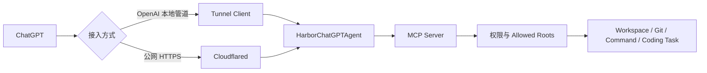
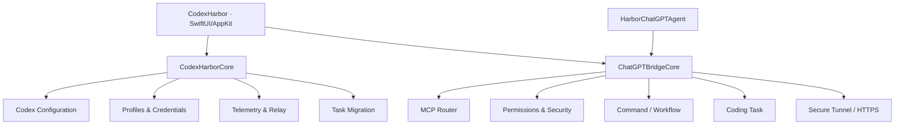

# Codex Harbor

<p align="center">
  <strong>原生 macOS AI 开发控制中心</strong><br>
  管理 Codex 连接，让 ChatGPT 安全接入本地项目，并把修改、测试、构建与打包串成可验证的 Coding Task。
</p>

<p align="center">
  
  
  
  
</p>

---

Codex Harbor 是一个面向 macOS 开发者的原生桌面应用。它把原本分散的 **Codex 账户/API 切换、ChatGPT MCP 接入、本地项目权限、文件修改、命令执行、测试构建、诊断与使用统计** 统一到一个控制面中。

它不是简单编辑 `~/.codex/config.toml` 的配置工具：Codex Harbor 会读取真实运行状态，以事务方式切换连接，对敏感配置和历史任务做保护，并通过独立的 `HarborChatGPTAgent` 将经过授权的本地开发能力暴露给 ChatGPT。

> Codex Harbor 是独立开源项目，不是 OpenAI 或 Cloudflare 的官方产品。

## 核心能力

### Codex 连接管理

Codex Harbor 当前支持三类 Codex 连接：

| 类型 | 能力 |
| --- | --- |
| 账户登录 | 保存多个 Codex 登录档案、检测可用性、切换当前账户 |
| 托管密钥 | 管理多个托管连接、查询用量与有效期、检测连接状态 |
| 自定义 API | 保存多个 API Provider、模型与凭据，独立统计请求与 Token |

连接切换不是简单覆盖配置。当前实现包含：

- 读取并识别 Codex **真实生效配置**
- 多账户、多托管密钥、多自定义 API 档案
- 原子更新 `config.toml` / `auth.json`
- 配置校验与失败回滚
- 部署前备份与精确恢复
- 必要时迁移历史任务 JSONL 与 SQLite 索引
- 外部修改检测，避免用 Harbor 的旧状态覆盖真实配置
- 登录状态变化监听与自动同步

### ChatGPT 接入

ChatGPT 可以通过 Codex Harbor 调用本机项目能力，而无需让整个文件系统暴露给远端。

目前支持两种独立的接入方式：

| 接入方式 | 说明 |
| --- | --- |
| OpenAI 本地管道 | 使用 OpenAI tunnel-client 建立受控的 MCP 通道 |
| 公网 HTTPS | 使用固定 HTTPS 地址与 cloudflared 暴露 MCP 服务 |

两套配置互相独立，可以长期共存和切换。Codex Harbor 会负责：

- 本地 Agent 生命周期管理
- MCP Server 启停与健康检查
- 仅监听 `127.0.0.1` 的本地服务
- Allowed Roots 项目目录授权
- Tunnel / HTTPS 运行状态检测
- Runtime Key / Access Token 生命周期处理
- 工具目录版本与 ChatGPT 已发现目录的差异检测
- 连接异常后的恢复与重新连接
- 自动下载当前 Mac 架构对应的 tunnel-client / cloudflared
- 下载校验与受控安装，不要求预装 Node、npm 或 Homebrew

典型链路：



### 本地 MCP 开发工具

当前版本内置 **23 个 MCP 工具**（实际数量以运行时 `tools/list` 为准），覆盖项目浏览、文件修改、Git、命令、工作流和 Coding Task。

| 类别 | 工具 |
| --- | --- |
| 工作区 | `open_workspace`, `read`, `search`, `list_directory`, `workspace_tree` |
| 文件与 Git | `edit`, `patch_file`, `write`, `git_diff`, `git_status` |
| 命令 | `run_command`, `bash`, `start_command`, `command_status`, `command_output`, `cancel_command` |
| 工作流 | `start_workflow`, `workflow_status`, `workflow_output`, `cancel_workflow`, `run_workflow`, `repair_project` |
| 高阶任务 | `coding_task` |

MCP Catalog 会根据工具定义自动生成版本号。服务端 `/health` 会同时返回协议版本、Catalog 版本、工具数量、Host 和 Port，便于检查 ChatGPT 是否仍缓存旧工具目录。

### Coding Task

`coding_task` 是 Codex Harbor 的高阶开发任务编排能力。一次任务围绕同一个 Task ID 持续执行：

```text
需求
  ↓
精准修改
  ↓
Git Diff
  ↓
测试
  ↓
构建
  ↓
打包
```

当测试或构建失败时：

```text
needsRepair
  ↓
读取结构化编译错误
  ↓
生成修复 Patch
  ↓
repair（保持同一个 Task ID）
  ↓
重新测试 / 构建 / 打包
```

支持的动作：

- `start`：创建任务并应用模型生成的精确修改
- `status`：查询当前阶段和每一步状态
- `output`：增量读取当前命令 stdout / stderr
- `repair`：在同一个 Task 上应用修复并自动重新验证
- `cancel`：停止当前命令并终止后续步骤

Harbor 负责**编排、权限、状态和验证**；代码理解与 Patch 仍由模型完成，不会让本地服务脱离上下文盲目重写源码。

项目工作流当前可自动识别：

- Swift Package
- Xcode Project
- Node.js
- Python
- Maven
- Gradle

对于无法识别验证/打包工作流的项目，Coding Task 不会先修改文件再返回“不支持”。

## 使用统计与运行状态

Codex Harbor 会聚合真实的 Codex 使用数据，而不是用 UI 操作次数代替请求量。

当前统计包括：

- 请求数
- Token
- 成功率
- 平均响应时间
- 按连接类型 / Profile 的趋势
- 今日、7 日、当月时间范围
- Relay 请求与 Token 使用
- Codex rollout Token 记录
- Codex thread/request 状态

Telemetry 使用增量游标和文件变化监听，避免持续全量扫描大型日志或 SQLite 数据库。

ChatGPT 接入侧当前记录的是 **MCP 工具调用审计、状态与诊断信息**。它不等同于整个 ChatGPT 账号的消息数、Token 使用量或订阅额度。

## 安全模型

Codex Harbor 对本地开发能力默认采用“限定范围 + 显式权限 + 可审计”的方式。

### 文件系统边界

- ChatGPT 只能打开位于 Allowed Roots 内的 Workspace
- 所有文件路径都经过标准化和越界检查
- 拒绝 `..`、符号链接逃逸等跨目录访问
- 大型生成目录在 Workspace Tree 中不会递归展开

### 修改和命令权限

修改、Shell 和 Git Push 分开控制：

- 文件修改：`allow / ask / deny`
- Shell：`allow / safeOnly / ask / deny`
- Git Push：`allow / ask / deny`

高风险命令会被额外分类。即使处于宽松模式，明确禁止的提权、递归强制删除、下载后直接执行等操作仍会被拦截。

### 本地凭据

Codex 与 ChatGPT Bridge 的敏感信息保存在 Harbor 自己的本地凭据库中：

- 原子写入
- 文件权限 `0600`
- 仅当前 macOS 用户可读
- MCP Access Token 使用安全随机数生成
- Runtime Key / API Key 不会在普通界面回显

独立 Agent 使用本地凭据文件而不是依赖应用进程的 Keychain 授权，避免 App 重签名或 Agent 独立启动时反复弹出系统授权框。

### 日志与诊断

- stdout / stderr 和审计摘要会经过常见 Token / API Key 脱敏
- Relay 持久化请求元数据与 Usage，不保存完整请求/响应正文
- Diagnostic Bundle 默认排除 Runtime Key、API Key、Authorization Header 和 Allowed Root 绝对路径
- MCP 内部诊断调用不会伪装成 ChatGPT 的工具目录发现

## 架构

Codex Harbor 使用 SwiftUI 为主、AppKit 补充，核心业务与 UI 分层：



主要 Target：

| Target | 职责 |
| --- | --- |
| `CodexHarbor` | macOS App、页面、ViewModel、交互 |
| `CodexHarborCore` | Codex 配置、连接档案、Telemetry、Relay、任务迁移 |
| `ChatGPTBridgeCore` | MCP、Workspace、权限、命令、诊断、Transport、Coding Task |
| `HarborChatGPTAgent` | 独立本地 Agent，承载 MCP Server 和接入链路 |

## 系统要求

### 运行

- macOS 14 或更高
- Codex CLI（使用 Codex 连接功能时）
- ChatGPT 侧具备可配置 MCP Server 的环境（使用 ChatGPT 接入时）
- 网络连接（首次下载 tunnel-client / cloudflared 或使用公网接入时）

Transport Installer 当前同时包含 Apple Silicon（arm64）与 Intel（x86_64）资源选择逻辑。

### 从源码开发

- Xcode / Swift 6 工具链
- Git
- macOS Command Line Tools

不要求 Node、npm 或 Homebrew 才能运行 ChatGPT 接入。

## 下载与安装

从 [Releases](../../releases) 下载最新的 macOS 压缩包，解压后将 `Codex Harbor.app` 放入“应用程序”。

当前项目构建产物使用 **ad-hoc 签名**。如果 macOS 首次打开提示来源未验证，可以在 Finder 中按住 Control 点击应用并选择“打开”。

正式的 Developer ID 签名与公证流程尚未接入仓库中的默认构建脚本。

## 快速开始

### 1. 配置 Codex 连接

打开 **Codex 连接**：

1. 添加账户登录、托管密钥或自定义 API
2. 检测连接状态
3. 选择目标连接并切换
4. 回到“概览”确认当前真实连接

Codex Harbor 会在切换时保护原配置，不需要手工编辑 `~/.codex/config.toml`。

### 2. 配置 ChatGPT 接入

打开 **ChatGPT 接入**：

1. 添加允许访问的项目目录
2. 选择“OpenAI 本地管道”或“公网 HTTPS”
3. 完成该方式所需配置
4. 启动并检测链路
5. 使用页面中的“去 ChatGPT 配置”完成 MCP Server 配置

页面会分别显示 Agent、MCP、Transport、远端入口和 ChatGPT 调用状态，便于定位故障发生在哪一层。

### 3. 使用本地开发能力

接入后，ChatGPT 可以在授权 Workspace 中执行类似流程：

```text
打开项目
→ 搜索/读取代码
→ 精准 Patch
→ 查看 Git Diff
→ 测试
→ 构建
→ 修复失败
→ 再验证
```

对于完整的“修改并测试/构建/打包”请求，优先使用 `coding_task` 维持一个连续 Task ID。

## 从源码构建

### 运行 Debug App

```bash
swift run CodexHarbor
```

### 编译

```bash
swift build
```

### 测试

```bash
swift test
```

测试使用临时目录和隔离配置，不应修改真实的 `~/.codex`。

### 构建 Release App

快速 Release 编译并安装：

```bash
./Scripts/build-app.sh fast
```

完整优化编译：

```bash
./Scripts/build-app.sh full
```

仅生成 Release App，不替换 `/Applications`，适用于 Coding Task 或 CI 风格验证：

```bash
./Scripts/build-app.sh fast --no-install
```

复用已有 Release 二进制，只重新打包：

```bash
./Scripts/build-app.sh package-only
```

产物：

```text
dist/Codex Harbor.app
```

默认安装脚本包含：

1. 防止重复构建的进程锁
2. Release 编译
3. Staging App 组装
4. ad-hoc codesign
5. Info.plist / 签名静态校验
6. 安全替换 `/Applications/Codex Harbor.app`
7. 暂存上一版本
8. Agent 重载
9. `/health` 与 MCP Catalog 校验
10. 失败时自动恢复上一版本

安装后的验证状态写入：

```text
/tmp/codexharbor-install-verify.status
/tmp/codexharbor-install-verify.log
```

## MCP 兼容性

当前 MCP Server：

- Server Name：`Codex Harbor Local`
- Server Version：`0.3.0`
- 现代协议：`2026-07-28`
- 保留旧协议兼容握手
- Tool Catalog 版本根据工具定义自动计算

健康端点示例：

```bash
curl http://127.0.0.1:19473/health
```

响应包含：

```json
{
  "status": "ok",
  "protocolVersion": "2026-07-28",
  "toolCatalogVersion": "3.0-23-...",
  "toolCount": 23,
  "host": "127.0.0.1",
  "port": 19473
}
```

如果 Harbor 已更新工具，而当前 ChatGPT 会话仍显示旧 Catalog，重新连接 MCP 或新建会话即可触发新的 `tools/list`。

## 数据目录

Codex 原生数据仍位于：

```text
~/.codex/
```

Codex Harbor 自己的连接、Telemetry、Profile、事务与 Relay 数据位于：

```text
~/Library/Application Support/Codex Harbor/
```

ChatGPT Bridge 的独立配置、权限、运行状态、凭据与审计数据位于：

```text
~/Library/Application Support/CodexHarbor/ChatGPTBridge/
```

> 不建议手工编辑这些运行态文件。连接与权限设置应通过 Codex Harbor UI 完成。

## 项目结构

```text
CodexHarbor/
├── Resources/
│   ├── AppIcon.icns
│   └── Info.plist
├── Scripts/
│   ├── build-app.sh
│   ├── verify-installed-app.sh
│   └── reload-and-verify-installed-app.sh
├── Sources/
│   ├── CodexHarbor/               # macOS App / SwiftUI / AppKit
│   ├── CodexHarborCore/           # Codex 配置、连接、Telemetry、Relay
│   ├── ChatGPTBridgeCore/         # MCP、权限、Workspace、Workflow、Coding Task
│   └── HarborChatGPTAgent/        # 独立 MCP Agent
├── Tests/
│   ├── CodexHarborCoreTests/
│   └── ChatGPTBridgeCoreTests/
├── Package.swift
├── DESIGN.md
├── PRODUCT.md
└── README.md
```

## 测试覆盖

测试重点覆盖：

- Codex 配置事务、切换与恢复
- 多 Profile 凭据和连接状态
- 历史任务迁移与回滚
- Relay Protocol 与 Usage
- Auth / Relay 文件变化监听
- Workspace 路径安全
- Patch / Unified Diff
- Git 状态与 Diff
- 命令超时、取消和输出流
- Workflow Session
- Coding Task 完整生命周期与 Repair
- MCP Discovery / tools/list / tool call
- Local MCP / Tunnel / HTTPS 健康检查
- Runtime Key 与 Transport 生命周期
- Diagnostic Bundle 脱敏
- 安装后 Agent / Catalog 一致性

提交改动前建议至少运行：

```bash
swift test
git diff --check
```

## 当前边界

为了避免把未实现能力写进 README，当前版本有以下明确边界：

- 仅支持 macOS
- 默认构建仍是 ad-hoc 签名，尚未提供 Developer ID 公证发布流水线
- “使用统计”目前主要统计 Codex 请求、Token、延迟和成功率
- ChatGPT 接入能记录 MCP 调用审计和诊断，但不能代表整个 ChatGPT 账号的消息数、Token 或订阅额度
- OpenAI 本地管道需要相应 Tunnel 配置；公网 HTTPS 需要相应 Cloudflare/域名配置
- ChatGPT 会话可能缓存旧 MCP Tool Catalog，工具变化后可能需要重新连接或新建会话
- Coding Task 只在存在可识别的验证/打包工作流时自动进入闭环，不会在无法验证的项目里先修改再宣告成功

## 开发原则

对 Codex Harbor 的修改应尽量保持这些约束：

- **真实状态优先**：UI 不用缓存状态覆盖 Codex 实际配置
- **失败可恢复**：配置切换、安装和迁移都必须保留回滚路径
- **权限最小化**：ChatGPT 只访问明确授权的 Workspace
- **精准修改**：优先 Patch，不使用无必要的整文件重写
- **验证闭环**：修改后运行针对性测试，再执行完整验证
- **统计口径稳定**：UI 重构不得改变现有请求/Token/趋势统计定义
- **秘密不进日志**：任何 Token、Key、Authorization 信息必须脱敏

## Contributing

欢迎通过 Issue 或 Pull Request 改进项目。

建议流程：

1. Fork / 创建独立分支
2. 保持改动范围清晰
3. 为行为变化补充测试
4. 运行 `swift test`
5. 运行 `git diff --check`
6. 不要在提交中包含真实 Token、Runtime Key、账号凭据或本地绝对路径

## License

Codex Harbor 使用 [MIT License](LICENSE)。

---

如果你正在调试连接问题，优先查看应用中的 **ChatGPT 接入 → 检测**；如果是 MCP 工具数量或版本不一致，先比较运行时 `/health` 的 `toolCatalogVersion` 与 ChatGPT 当前会话发现的 Catalog。
